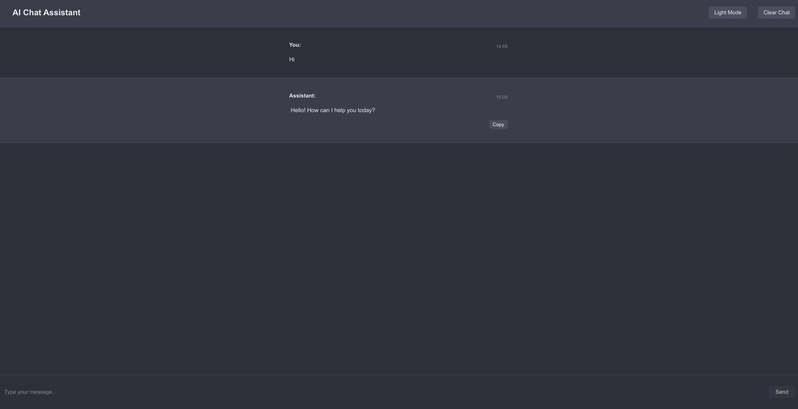

# AI Chat Assistant

A professional, full-stack AI chatbot built with React, Express, and TypeScript. This project demonstrates modern web development practices and showcases a range of useful features and clean code quality.

## Features
- ChatGPT-like user interface
- Streaming AI responses
- Message timestamps
- Copy response button
- Theme toggle (light/dark mode)
- Stop button to interrupt responses
- Error handling and retry
- Responsive, mobile-friendly design

## Screenshots


## Tech Stack
- **Frontend:** React, Vite, TypeScript
- **Backend:** Express, TypeScript

## Getting Started

### Prerequisites
- Node.js (v18+ recommended)
- npm

### Installation
```bash
git clone https://github.com/yourusername/ai-chat-assistant.git
cd ai-chat-assistant
cd backend
npm install
cd ../frontend
npm install
```

### Running Locally
Start backend:
```bash
cd backend
npm run dev
```
Start frontend:
```bash
cd frontend
npm run dev
```
Visit [http://localhost:5173](http://localhost:5173)

## Usage
Type your message and interact with the AI assistant. Use the copy button to copy responses, toggle themes, and stop responses as needed.

## Project Structure
```
chatbot-new/
├── backend/      # Express + TypeScript API server
├── frontend/     # React + Vite + TypeScript client
└── README.md     # Project documentation
```


Feel free to fork, contribute, or reach out for collaboration!
